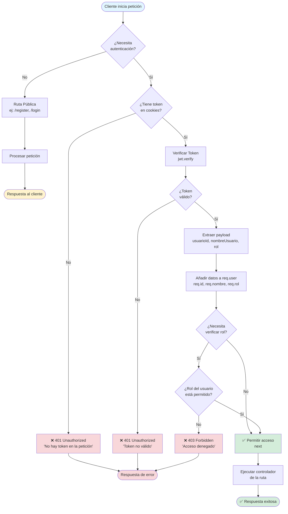
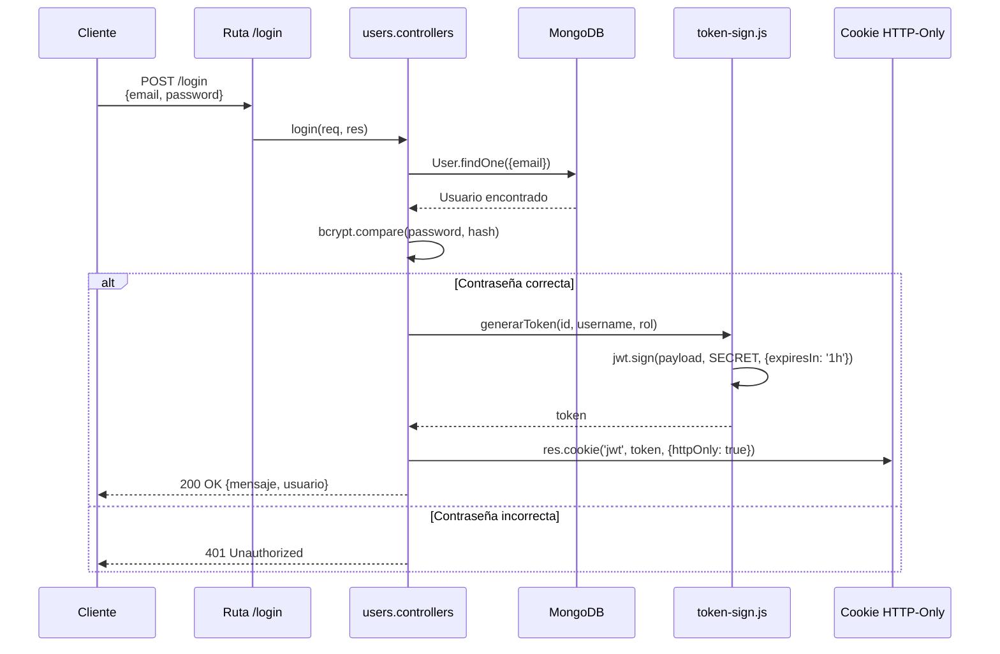
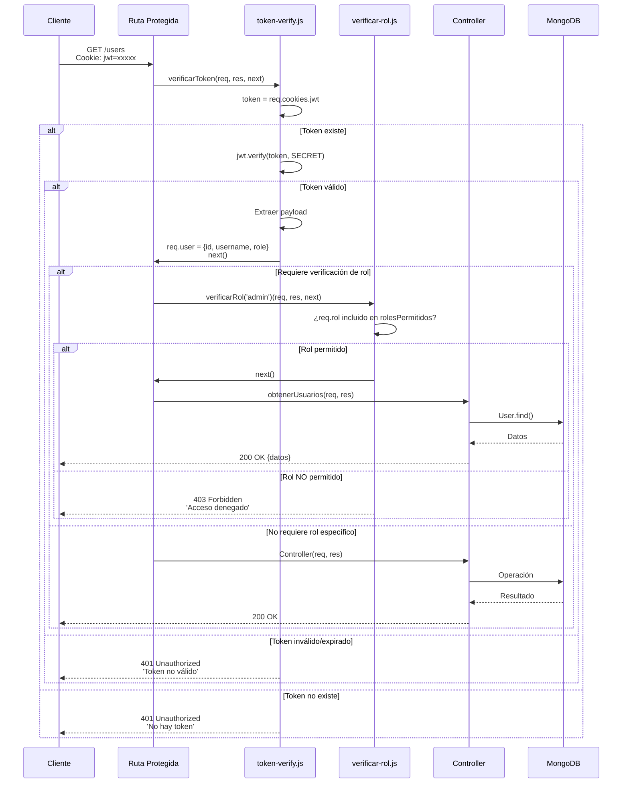

# 🔐 Flujo de Autenticación JWT en el Backend

Este documento explica cómo se utiliza **JSON Web Token (JWT)** para proteger las rutas del backend y controlar el acceso mediante roles.

---

## 📊 Diagrama de Flujo General



---

## 🔄 Flujo Detallado: Login y Generación de Token



---

## 🛡️ Flujo Detallado: Acceso a Ruta Protegida



---

## 📂 Componentes del Sistema

### 1. **token-sign.js** - Generación de Token

**Ubicación:** `src/auth/token-sign.js`

**Función:** Genera un JWT con los datos del usuario autenticado.

```javascript
const generarToken = (idUsuario, nombreUsuario, rolUsuario) => {
    return new Promise((resolve, reject) => {
        const payload = { 
            usuarioId: idUsuario, 
            nombreUsuario: nombreUsuario,
            rol: rolUsuario 
        };

        jwt.sign(
            payload,
            process.env.JWT_SECRET_KEY,
            { expiresIn: '1h' },
            (error, token) => {
                if (error) reject(new Error('Error al generar el token'));
                else resolve(token);
            }
        );
    });
};
```

**Características:**
- ✅ Payload incluye: `usuarioId`, `nombreUsuario`, `rol`
- ✅ Expiración: 1 hora
- ✅ Firma con `JWT_SECRET_KEY` del entorno
- ✅ Retorna una Promise

---

### 2. **token-verify.js** - Middleware de Verificación

**Ubicación:** `src/auth/token-verify.js`

**Función:** Valida el token JWT y extrae los datos del usuario.

```javascript
const verificarToken = (req, res, next) => {
    const token = req.cookies?.jwt;
    
    if(!token){
        return res.status(401).json({
            mensaje: "No hay token en la peticion"
        })
    }

    try {
        const payload = jwt.verify(token, process.env.JWT_SECRET_KEY)
        
        req.user = {
            id: payload.usuarioId,
            username: payload.nombreUsuario,
            role: payload.rol
        };
        
        req.id = payload.usuarioId;
        req.nombre = payload.nombreUsuario;
        req.rol = payload.rol;
    }
    catch (error) {
        return res.status(401).json({
            mensaje: "Token no valido" 
        })      
    }
    next();
}
```

**Características:**
- ✅ Lee el token desde `req.cookies.jwt` (HTTP-Only cookie)
- ✅ Verifica firma y expiración con `jwt.verify()`
- ✅ Agrega datos del usuario a `req.user`, `req.id`, `req.nombre`, `req.rol`
- ✅ Retorna 401 si no hay token o es inválido

---

### 3. **verificar-rol.js** - Middleware de Autorización por Rol

**Ubicación:** `src/auth/verificar-rol.js`

**Función:** Verifica que el usuario tenga uno de los roles permitidos.

```javascript
const verificarRol = (...rolesPermitidos) => {
    return (req, res, next) => {
        if (!req.id) {
            return res.status(401).json({
                mensaje: "Usuario no autenticado"
            });
        }

        if (!req.rol) {
            return res.status(403).json({
                mensaje: "Usuario sin rol asignado"
            });
        }

        if (!rolesPermitidos.includes(req.rol)) {
            return res.status(403).json({
                mensaje: `Acceso denegado. Se requiere uno de los siguientes roles: ${rolesPermitidos.join(', ')}`
            });
        }

        next();
    };
};
```

**Características:**
- ✅ Acepta múltiples roles permitidos: `verificarRol('admin', 'moderador')`
- ✅ Valida que el usuario esté autenticado (`req.id` existe)
- ✅ Valida que el usuario tenga rol asignado (`req.rol` existe)
- ✅ Retorna 403 si el rol no está permitido

---

## 🚀 Ejemplos de Uso en Rutas

### Ejemplo 1: Ruta Protegida (Solo Autenticación)

```javascript
import verificarToken from '../auth/token-verify.js';

router.route('/users')
    .get(verificarToken, obtenerUsuarios);  // ✅ Requiere token válido
```

**Flujo:**
1. Cliente hace `GET /users` con cookie JWT
2. Middleware `verificarToken` valida el token
3. Si es válido → ejecuta `obtenerUsuarios`
4. Si es inválido → retorna 401

---

### Ejemplo 2: Ruta Protegida con Rol Específico

```javascript
import verificarToken from '../auth/token-verify.js';
import verificarRol from '../auth/verificar-rol.js';

router.route('/admin/users')
    .delete(verificarToken, verificarRol('admin'), eliminarUsuario);
```

**Flujo:**
1. Cliente hace `DELETE /admin/users` con cookie JWT
2. Middleware `verificarToken` valida el token
3. Middleware `verificarRol('admin')` verifica que `req.rol === 'admin'`
4. Si ambos pasan → ejecuta `eliminarUsuario`
5. Si falla verificación → retorna 401 o 403

---

### Ejemplo 3: Ruta con Múltiples Roles Permitidos

```javascript
router.route('/products/:id')
    .patch(verificarToken, verificarRol('admin', 'vendedor'), actualizarProducto);
```

**Flujo:**
1. Solo usuarios con rol `'admin'` o `'vendedor'` pueden actualizar productos
2. Usuarios con otros roles reciben 403

---

### Ejemplo 4: Ruta Pública (Sin Protección)

```javascript
router.route('/register')
    .post(validarUsuario, registrarUsuario);  // ❌ No requiere token

router.route('/login')
    .post(login);  // ❌ No requiere token (obviamente)
```

**Flujo:**
1. No se usa `verificarToken`
2. Cualquier usuario puede acceder

---

## 🔑 Variables de Entorno Requeridas

Archivo: `.env`

```env
JWT_SECRET_KEY=tu_clave_secreta_super_segura_aqui
```

⚠️ **Importante:** 
- La `JWT_SECRET_KEY` debe ser una cadena larga y aleatoria
- No la compartas ni la subas a repositorios públicos
- Usa diferentes claves en desarrollo y producción

---

## 📝 Proceso Completo: De Login a Ruta Protegida

### Paso 1: Usuario hace Login

```http
POST /login
Content-Type: application/json

{
  "email": "usuario@ejemplo.com",
  "password": "miPassword123"
}
```

**Respuesta:**
```http
HTTP/1.1 200 OK
Set-Cookie: jwt=eyJhbGciOiJIUzI1NiIsInR5cCI6IkpXVCJ9...; HttpOnly; Path=/

{
  "mensaje": "Login exitoso",
  "usuario": {
    "id": "507f1f77bcf86cd799439011",
    "username": "usuario123",
    "role": "user"
  }
}
```

### Paso 2: Cliente almacena la cookie automáticamente

El navegador guarda la cookie `jwt` automáticamente (HttpOnly).

### Paso 3: Cliente accede a ruta protegida

```http
GET /users
Cookie: jwt=eyJhbGciOiJIUzI1NiIsInR5cCI6IkpXVCJ9...
```

**Respuesta (si tiene permisos):**
```http
HTTP/1.1 200 OK

{
  "usuarios": [...]
}
```

**Respuesta (si no tiene token):**
```http
HTTP/1.1 401 Unauthorized

{
  "mensaje": "No hay token en la peticion"
}
```

**Respuesta (si no tiene rol adecuado):**
```http
HTTP/1.1 403 Forbidden

{
  "mensaje": "Acceso denegado. Se requiere uno de los siguientes roles: admin"
}
```

---

## 🛠️ Códigos de Estado HTTP

| Código | Significado | Cuándo se usa |
|--------|-------------|---------------|
| **200** | OK | Token válido, acceso permitido |
| **401** | Unauthorized | No hay token o token inválido/expirado |
| **403** | Forbidden | Token válido pero rol insuficiente |

---

## ✅ Ventajas de esta Implementación

1. **Seguridad:** Token almacenado en HttpOnly cookie (no accesible desde JavaScript)
2. **Expiración:** Tokens expiran en 1 hora automáticamente
3. **Stateless:** No se guardan sesiones en el servidor
4. **Escalable:** Funciona en arquitecturas distribuidas
5. **Control de acceso:** Sistema de roles flexible
6. **Compatibilidad:** `req.user` y `req.id/nombre/rol` para retrocompatibilidad

---

## 🔒 Mejores Prácticas

1. ✅ **Usa HTTPS en producción** para que las cookies no sean interceptadas
2. ✅ **Rota JWT_SECRET_KEY periódicamente**
3. ✅ **Implementa refresh tokens** para sesiones más largas
4. ✅ **Valida siempre el token antes de rutas sensibles**
5. ✅ **Usa roles con principio de menor privilegio**
6. ✅ **Registra intentos de acceso no autorizado** (logging)

---

## 📚 Recursos Adicionales

- [JWT.io - Debugger](https://jwt.io/) - Para inspeccionar tokens
- [RFC 7519 - JWT](https://datatracker.ietf.org/doc/html/rfc7519) - Especificación oficial
- [OWASP JWT Cheat Sheet](https://cheatsheetseries.owasp.org/cheatsheets/JSON_Web_Token_for_Java_Cheat_Sheet.html)

---

**Fecha de creación:** 5 de noviembre de 2025  
**Proyecto:** Backend MERN - Ejemplo con JWT
